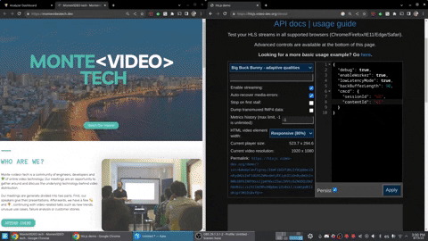
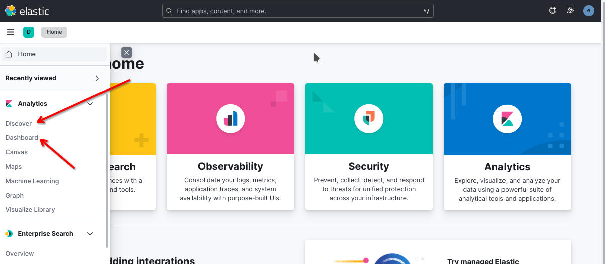
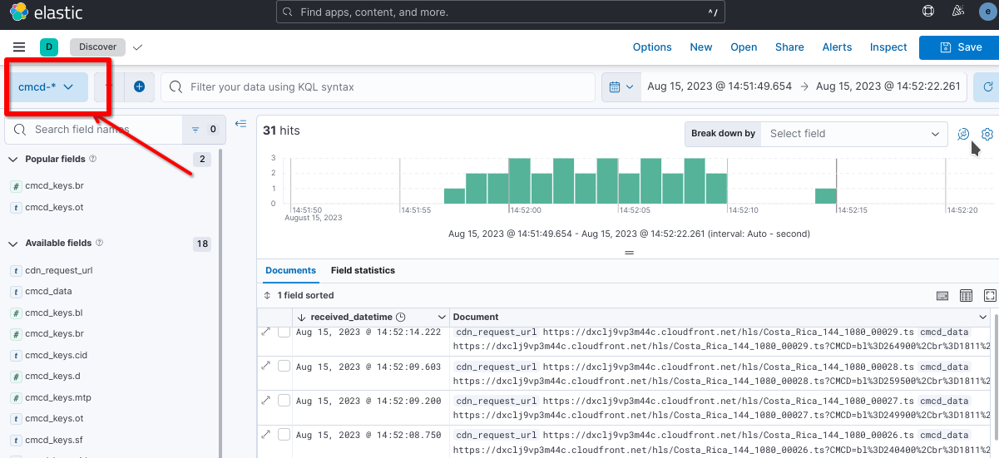
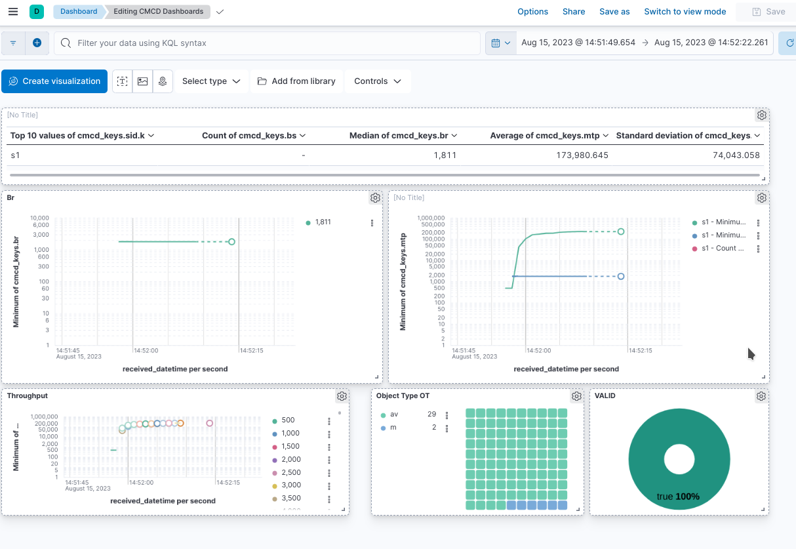

# CMCD-Analyzer

**Welcome to CMCD-Analyzer.**
The CMCD-Analyzer allows any developer or tester to collect and analyze data from any type of player that has CMCD implemented. To be more specific, it will intercept players requests to check if the CMCD keys sent to the CDN are valid or not regarding the [CMCD Standard](https://cdn.cta.tech/cta/media/media/resources/standards/pdfs/cta-5004-final.pdf). 

This project utilizes Elasticsearch to store the data and Kibana for data visualization and graphing.

## Table of Contents

* [Run the environment](#Run-the-environment)
* [Usage](#Usage)
* [Build modified URL](#Build-modified-URL)
* [Analyze data](#Analyze-data)

## Run the enviroment
To run the CMCD-Analyzer enviroment you will need to have installed and running:

- [Docker](https://docs.docker.com/get-docker/)
- [docker-compose](https://docs.docker.com/compose/install/)  

When everything's ready, use docker-compose in your preferred command line running the command:

````
docker-compose up
````

>  **_NOTE:_** It takes a while for the system to be up the first time the command is run because Docker has to download all the images to create the containers.

After everyting is up and running you will have a full system to valdidate and analyze CMCD throw this tools:
* A web to do simple validation: http://localhost:5173/
* Kibana to perform advance analysis: http://localhost:5601/
  * Default user: `elastic`
  * Defautl password: `changeme`

To stop the system and remove the containers you have to press `Ctrl+c` and then run the command:

````
docker-compose down
````

## Analyzing CMCD through the Web
This is the simplest way to extract and analyze CMCD using this project. After having the service running in your environment, follow these steps:



1. Access the web via http://\<your-ip>:5173
> If you're running it on your own PC, just go to http://localhost:5173

2. Enter the video you want to use to analyze the CMCD implementation in "Video URL"
3. Verify that the IP is accessible from the device you're testing on. If you're testing on the same PC, you can use "localhost," which is the default value.
4. Click "Generate URL" and copy the final URL.
5. Enter the URL in the player you want to test and hit play!
6. If the playback is correct, you'll see the results of the CMCD value extraction on the web


## Analyzing CMCD through Kibana
Using Kibana, it's possible to view the data obtained by the CMCD extractor and create different charts. This data is stored in Elasticsearch using the `cmcd-<id>` index pattern, where `<id>` corresponds to a playback (see [Build a modified URL](#build-a-modified-url) for more information).

The Kibana instance comes with pre-configured indices and a dashboard named CMCD that generates a set of basic charts.

In this chapter we will mention to the Discover and the Dashbaord tool that can be found in Kibana's menu



### Discover tool
With this tool you can search and explore the CMCD collected. Checkout [this guide](https://www.elastic.co/guide/en/kibana/current/discover.html) to learn more about Discover




1. Go to the Kibana Discover view (http://\<your-ip>:5601/app/discover).
2. Change the index pattern to `cmcd-*` as shown in red in the previous image.
3. Change the time filter if needed to find your data.

### CMCD pre-loaded dashboard
In the dashbaord menu you will find a pre-loadad dashbard called `CMCD Dashboards`. Here you will find some basic charts to start exploring your data.



To learn more about dahsbards in Kibana take a look at [this guide](https://www.elastic.co/guide/en/kibana/current/dashboard.html) 
## Advanced topics
### Highg level arquitecture of the solution
Below you can see the architecture diagram of the solution and the interaction diagram between the various components to achieve the extraction of CMCD generated by a video player.


### Build a modified URL
#### A modified URL should be structured like this:

````
<ip>:<port>/video/<id>/<base_64_encoded>/<file-name>
````

>  **_NOTE:_** The 'base_64_encoded' is the url of the video without it's name, put into a json and encoded to base64.

#### Non-modified URL example:

````
https://dxclj9vp3m44c.cloudfront.net/hls/Costa_Rica_144.m3u8

````

>  **_NOTE:_** The part of this URL you should build as a JSON and encode is: ````https://dxclj9vp3m44c.cloudfront.net/hls/````

>It would look like this:

````
{
“url”: “https://dxclj9vp3m44c.cloudfront.net/hls/"
}
````

> To encode it you can use [Base64 Encode](https://www.base64encode.org/)

#### URL example modified:

````
http://localhost:3000/video/1/ew0KIOKAnHVybOKAnTog4oCcaHR0cHM6Ly9keGNsajl2cDNtNDRjLmNsb3VkZnJvbnQubmV0L2hscyINCn0=/Costa_Rica_144.m3u8

````

